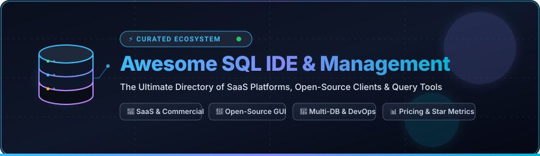

# 🚀 Awesome SQL IDE & Database Management Tools

  

  
  
  
  
  
  
  

---

## 🧭 Overview & Ecosystem Guide

A curated directory of **SQL IDEs**, **Database Management GUI Clients**, **Schema Management**, **Query Profilers**, and **Multi-Database Administration Platforms**. Whether you are working with PostgreSQL, MySQL, MariaDB, SQLite, Microsoft SQL Server, Oracle, Snowflake, ClickHouse, or NoSQL databases (MongoDB, Redis), this repository indexes both leading **commercial SaaS solutions** and battle-tested **open-source projects**.

---

## 📑 Table of Contents

- [💎 SaaS & Commercial Platforms](#-saas--commercial-platforms)
- [🌟 Open-Source GitHub Projects](#-open-source-github-projects)
  - [🖥️ Desktop Database GUIs & IDEs](#️-desktop-database-guis--ides)
  - [🌐 Web-Based Database Management & BI Query Editors](#-web-based-database-management--bi-query-editors)
  - [⚡ Supercharged CLI & Terminal Clients](#-supercharged-cli--terminal-clients)
- [🎯 Choosing the Right Tool](#-choosing-the-right-tool)
- [🤝 How to Contribute](#-how-to-contribute)
- [📈 Star History](#-star-history)
- [📜 Disclaimer & License](#-disclaimer--license)

---

## 💎 SaaS & Commercial Platforms

> 📊 **Market Overview & Industry Structure**: The Global Database Management Tools & SQL IDE software market is estimated at **$5.2 Billion – $7.8 Billion USD** (growing at an estimated CAGR of ~13.4%). The sector is **moderately to highly fragmented** rather than winner-take-all: enterprise legacy champions (e.g., Quest Toad, JetBrains, Idera) co-exist with fast-growing modern native clients (TablePlus, Bytebase) and widely adopted open-source ecosystems (DBeaver, Beekeeper Studio, pgAdmin).

The table below is sorted in descending order by estimated **Company Size / Valuation / Annual Revenue**:

| Product | Company Scale / Valuation / Revenue | Description | Starting Pricing | Free Tier / Trial Limits |
| :--- | :--- | :--- | :--- | :--- |
| **[Toad for Oracle](https://www.quest.com/toad/)** | **~$1.3B+ Revenue / ~$5.4B Valuation** *(Quest Software / Clearlake Capital)* | Enterprise database management and PL/SQL development suite with deep code optimization, automated testing, and DBA tooling. | $550/user/yr for Base Edition subscription | 30-day full-featured free trial with complete access to evaluate all capabilities |
| **[JetBrains DataGrip](https://www.jetbrains.com/datagrip/)** | **~$450M+ Revenue / ~$7B+ Valuation** *(JetBrains s.r.o.)* | Powerful cross-platform SQL IDE with deep code intelligence, smart refactoring, and multi-engine database support. | $10.90/user/mo (or $109/yr) for individuals; $24.90/user/mo (or $249/yr) for organizations | **Free forever** for non-commercial use (learning, hobby, open-source); 30-day full-featured free trial for commercial use |
| **[Aqua Data Studio](https://www.aquafold.com/)** | **~$400M–$500M Revenue / ~$3B+ Valuation** *(Idera, Inc. / AquaFold)* | Universal database IDE and visual analytics tool supporting 40+ database platforms with ER modeling and visual query building. | $499/user/yr for Standard Edition | 14-day full-featured free trial with all visual analytics, ER diagramming, and administration tools |
| **[dbForge Studio](https://www.devart.com/dbforge/)** | **~$30M–$50M Revenue** *(Devart Software)* | Feature-rich IDEs for SQL Server, MySQL, Oracle, and PostgreSQL with visual query design, data comparison, synchronization, and debugging. | $199.95/yr for MySQL/PostgreSQL Standard; $399.95/yr for SQL Server Standard | 30-day full-featured free trial (Enterprise features); automatically reverts to permanent free **Express Edition** forever (core editing/formatting, no visual query builder or diff tools) |
| **[Navicat](https://www.navicat.com/)** | **~$20M–$35M Revenue** *(PremiumSoft CyberTech)* | Universal multi-database administration and design GUI supporting MySQL, PostgreSQL, Oracle, SQLite, SQL Server, Redis, and MongoDB. | $19.99/mo (or $199.90/yr) for single DB; $39.99/mo (or $399.90/yr) for Navicat Premium | **Navicat Premium Lite** is free forever for commercial and non-commercial use (basic operations, up to 5 user accounts per organization); 14-day full-featured free trial for Premium |
| **[DBeaver PRO](https://dbeaver.com/)** | **~$15M–$25M Revenue** *(DBeaver Corporation)* | Extended commercial editions (Lite, Enterprise, Ultimate) adding NoSQL support, schema comparison, visual query builder, and team management. | $11/user/mo (or $110/user/yr) for Lite; $25/user/mo (or $250/user/yr) for Enterprise | 14-day full-featured free trial across all PRO editions; non-commercial Early Access Program with max 3 concurrent connections and 5 tasks |
| **[TablePlus](https://tableplus.com/)** | **~$5M–$10M ARR** *(TablePlus Inc.)* | Native, blazing-fast database management client with inline editing, multiple tabs, and lightweight UI across macOS, Windows, and Linux. | $89 one-time perpetual license (1 year updates, 1 device); $9.99/mo subscription | **Free forever plan** with limits: max 2 open tabs, 2 open query windows, and 2 active filters simultaneously |
| **[PopSQL](https://popsql.com/)** | **~$5M–$10M ARR / ~$50M+ Valuation** *(PopSQL / Bytebase)* | Collaborative SQL editor for teams with shared queries, version history, autocomplete, and scheduled dashboards. | $19/editor/mo for Premium plan; $36/editor/mo for Business plan | **Free forever plan** limited to 1 editor, 10 saved queries, 2 database connections, 2 dashboards, 2 weekly schedules, 1-day version history, and 1-hour run history |
| **[SQLGate](https://www.sqlgate.com/)** | **~$3M–$6M Revenue / ~$30M Valuation** *(CHEQUER Inc.)* | Multi-database IDE for Oracle, SQL Server, MySQL, PostgreSQL, and DB2 with multi-query execution and reporting. | $15/user/mo (or $150/user/yr) for MySQL/PostgreSQL Standard; $25/user/mo for Oracle/SQL Server | **Free Version** forever limited to 1 concurrent connection session, 1 editor window/tab, and 5 concurrent query executions; 14-day free trial for Standard edition |
| **[Valentina Studio](https://www.valentina-db.com/en/valentina-studio-overview)** | **~$1M–$3M Revenue** *(Paradigma Software)* | Cross-platform database GUI for MySQL, PostgreSQL, SQLite, MS SQL Server, and Valentina DB with schema and data management. | $199.99 perpetual license (or $79.99 single-OS license) for Valentina Studio PRO | **Valentina Studio (Free edition)** is free forever with unlimited tables/records for core database management, schema editing, and SQL querying; PRO tools require paid license |

---

## 🌟 Open-Source GitHub Projects

Below are top open-source database IDEs, web management portals, and CLI utilities, **sorted in descending order by GitHub stars**. Each repository includes a real-time star badge linking directly to its stargazers page.

### 🖥️ Desktop Database GUIs & IDEs

- **[DBeaver Community](https://github.com/dbeaver/dbeaver)**   
  Universal open-source database tool for developers, DBAs, and analysts. Supports any database with a JDBC driver (PostgreSQL, MySQL, SQLite, Oracle, SQL Server, ClickHouse, DuckDB, Trino, etc.). Features ER diagrams, visual data editing, SQL script management, and extensions.

- **[Chat2DB](https://github.com/chat2db/Chat2DB)**   
  AI-powered open-source database client and SQL tool supporting Natural Language to SQL, intelligent code completions, SQL debugging, and multi-database management.

- **[DB Browser for SQLite](https://github.com/sqlitebrowser/sqlitebrowser)**   
  High-quality, visual, open-source tool to create, design, and edit SQLite database files. Ideal for mobile and embedded application developers.

- **[Beekeeper Studio](https://github.com/beekeeper-studio/beekeeper-studio)**   
  Modern, fast, and privacy-focused SQL editor and database manager built with Vue and Electron. Supports PostgreSQL, MySQL, SQLite, SQL Server, CockroachDB, MariaDB, and Redis.

- **[DbGate](https://github.com/dbgate/dbgate)**   
  Smart open-source SQL + NoSQL database manager that runs seamlessly as both a desktop app (Electron) and a browser-based web application (Docker/NPM). Supports MySQL, PostgreSQL, SQL Server, Oracle, MongoDB, Redis, and SQLite.

- **[HeidiSQL](https://github.com/HeidiSQL/HeidiSQL)**   
  Lightweight, lightning-fast Windows GUI client for MySQL, MariaDB, Percona, PostgreSQL, Microsoft SQL Server, and SQLite. Supports session management, bulk data export, user permission editing, and query optimization.

- **[Sqlectron](https://github.com/sqlectron/sqlectron-gui)**   
  Lightweight SQL client desktop application with a simple, focused user experience supporting PostgreSQL, MySQL, Microsoft SQL Server, and SQLite.

- **[pgAdmin 4](https://github.com/pgadmin-org/pgadmin4)**   
  The official, feature-rich administration and development platform for PostgreSQL. Offers server status monitoring, schema diffing, visual query execution planning, and procedural language debugging.

---

### 🌐 Web-Based Database Management & BI Query Editors

- **[Apache Superset](https://github.com/apache/superset)**   
  Enterprise-ready data exploration and visualization platform featuring a powerful SQL Lab IDE, metadata browser, and asynchronous query execution across all SQL databases.

- **[Metabase](https://github.com/metabase/metabase)**   
  Open-source business intelligence and database exploration tool with a native SQL query builder, interactive dashboards, scheduled reports, and visual schema inspection.

- **[Redash](https://github.com/getredash/redash)**   
  Collaborative SQL query workspace connecting to dozens of SQL and NoSQL data sources with live dashboards, alert notifications, and team query sharing.

- **[Bytebase](https://github.com/bytebase/bytebase)**   
  Open-source Database DevOps and CI/CD collaboration platform for schema change management, web-based SQL IDE with data masking, and role-based access control (RBAC).

- **[phpMyAdmin](https://github.com/phpmyadmin/phpmyadmin)**   
  Classic, ubiquitous web-based database management tool for MySQL and MariaDB with comprehensive table, index, query, user permission, and export management.

- **[Adminer](https://github.com/vrana/adminer)**   
  Extremely lightweight single-file PHP database management tool. Supports MySQL, MariaDB, PostgreSQL, SQLite, MS SQL, Oracle, SimpleDB, Elasticsearch, and MongoDB.

- **[SQLPad](https://github.com/sqlpad/sqlpad)**   
  Web-based SQL editor and visualization app that runs in your browser, connecting to MySQL, Postgres, SQL Server, ClickHouse, Snowflake, Presto, SQLite, and more.

- **[CloudBeaver](https://github.com/dbeaver/cloudbeaver)**   
  Cloud and web-based version of DBeaver providing lightweight browser access to SQL and cloud databases with enterprise security and authentication.

---

### ⚡ Supercharged CLI & Terminal Clients

- **[pgcli](https://github.com/dbcli/pgcli)**   
  Command-line interface for PostgreSQL with auto-completion and syntax highlighting.

- **[mycli](https://github.com/dbcli/mycli)**   
  Command-line interface for MySQL, MariaDB, and Percona with smart auto-completion and syntax highlighting.

- **[usql](https://github.com/xo/usql)**   
  Universal command-line interface for SQL and NoSQL databases written in Go, supporting PostgreSQL, MySQL, Oracle, SQLite, SQL Server, Snowflake, ClickHouse, and 30+ others.

---

## 🎯 Choosing the Right Tool

| Use Case | Recommended Open-Source Tool | Recommended SaaS / Commercial Tool |
| :--- | :--- | :--- |
| **Universal Multi-DB Work** | [DBeaver Community](https://github.com/dbeaver/dbeaver), [Beekeeper Studio](https://github.com/beekeeper-studio/beekeeper-studio) | [JetBrains DataGrip](https://www.jetbrains.com/datagrip/), [Navicat](https://www.navicat.com/) |
| **PostgreSQL Specialized** | [pgAdmin 4](https://github.com/pgadmin-org/pgadmin4), [pgcli](https://github.com/dbcli/pgcli) | [DataGrip](https://www.jetbrains.com/datagrip/), [TablePlus](https://tableplus.com/) |
| **MySQL & MariaDB Specialized** | [HeidiSQL](https://github.com/HeidiSQL/HeidiSQL), [phpMyAdmin](https://github.com/phpmyadmin/phpmyadmin), [mycli](https://github.com/dbcli/mycli) | [dbForge Studio for MySQL](https://www.devart.com/dbforge/) |
| **Oracle PL/SQL & Tuning** | [DBeaver Community](https://github.com/dbeaver/dbeaver) | [Toad for Oracle](https://www.quest.com/toad/) |
| **SQL Server (T-SQL)** | [DbGate](https://github.com/dbgate/dbgate), [Beekeeper Studio](https://github.com/beekeeper-studio/beekeeper-studio) | [dbForge Studio for SQL Server](https://www.devart.com/dbforge/) |
| **Lightweight Native Desktop** | [Beekeeper Studio](https://github.com/beekeeper-studio/beekeeper-studio), [DB Browser for SQLite](https://github.com/sqlitebrowser/sqlitebrowser) | [TablePlus](https://tableplus.com/) |
| **Team Collaboration & Analytics** | [Apache Superset](https://github.com/apache/superset), [Metabase](https://github.com/metabase/metabase), [Bytebase](https://github.com/bytebase/bytebase) | [PopSQL](https://popsql.com/) |
| **Web / Docker Single-Host Admin** | [CloudBeaver](https://github.com/dbeaver/cloudbeaver), [Adminer](https://github.com/vrana/adminer) | [DBeaver Team / Cloud Edition](https://dbeaver.com/) |

---

## 🤝 How to Contribute

Contributions are welcome! Please follow these guidelines:

1. 🍴 **Fork the repository** on GitHub.
2. 📝 **Add or update an entry** in `README.md` following the existing format:
   - For SaaS: include name, official link, company size/revenue, description, starting price, and specific free tier/trial limits.
   - For Open-Source: include name, GitHub repository link, star badge (`style=social&color=white` linked to `/stargazers`), and factual description.
3. 🔎 Ensure all links, pricing details, and star counts are accurate and current.
4. 🚀 **Submit a Pull Request** with a concise description of your changes.

---

## 📈 Star History

---

## 📜 Disclaimer & License

- This is a community-curated list and is not an official endorsement of any vendor or project.
- Database clients handle production credentials, keys, and confidential datasets. Always prefer encrypted connections (SSL/TLS, SSH Bastion Tunnels, Secrets Managers) and adhere to the principle of least privilege.
- Distributed under the [MIT License](LICENSE).

---

  <b>Built for developers, DBAs, data engineers, and SQL enthusiasts worldwide. 🌐</b>

